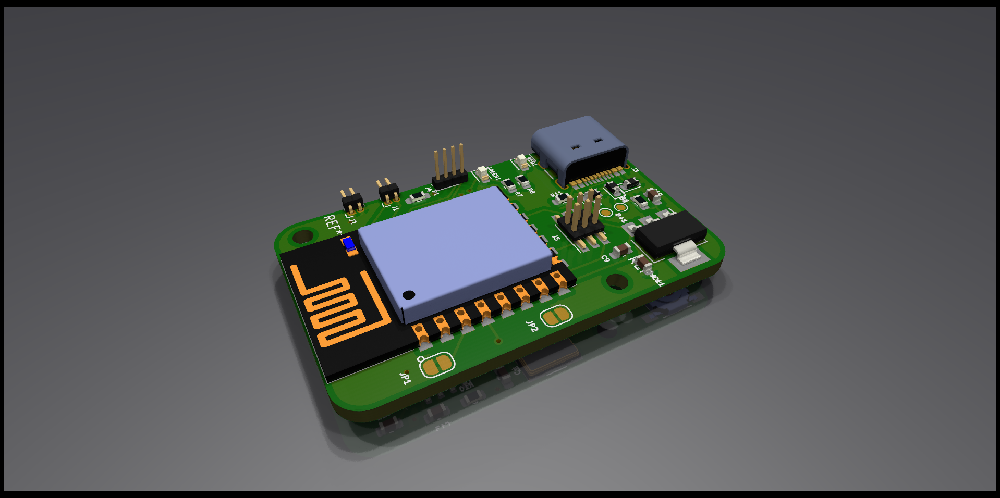
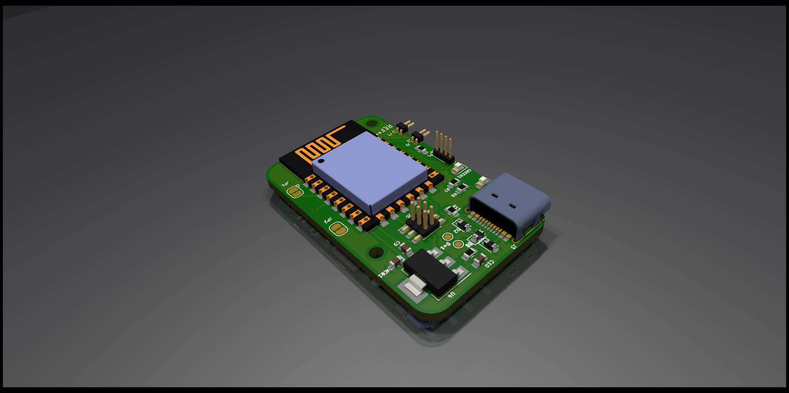

# RKY 

## Multipurpose Remote Key Fob

## Functions
* Remote access ( start,horn,disable --car,bike,room)
* Display Informations, recieved from NRF24L01,WiFi
* Rolling codes
* buzzer
* vibration while near field detection
* compass directions
* preset commands in key, whenever a source device detect, it apply the commands
* disply time 

## Features

## Specifications
* Vibrator Motor
* LED BLINK
* OLED display
* WiFi connectivity
* RF transmitter
* NRF24L01
* 

~~~mermaid
graph TD
power--> ESP8266
NRF24L01--> ESP8266
OLED--> ESP8266
UART --> ESP8266
power-->NRF24L01
power-->OLED
power-->UART

~~~

